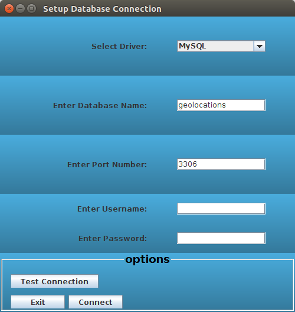
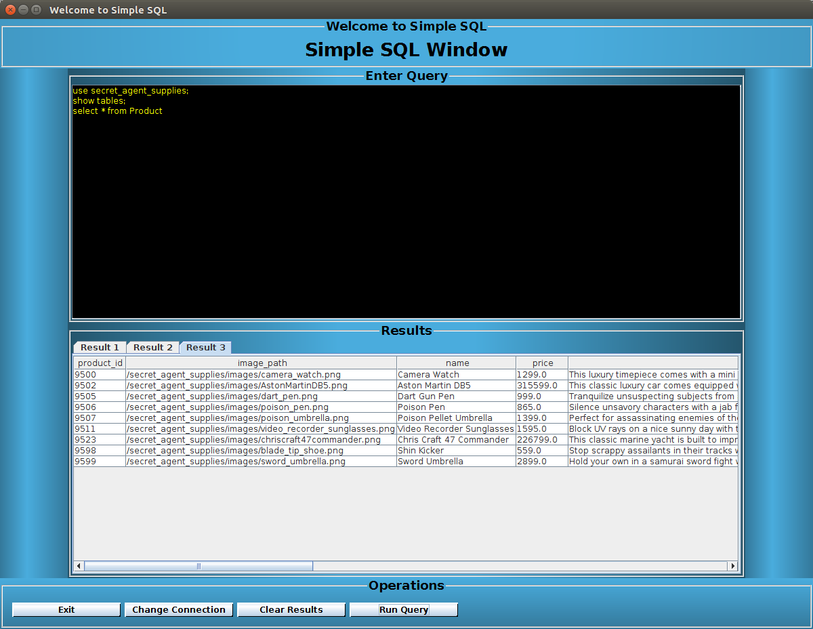

# simple-sql-window

## Program Description

This Java Swing program allows the user to connect to a database and execute various queries. On startup, a setup window appears to collect connection properties for the database. Once tested, the connection properties are saved and used for queries ececuted from the query window. The simple program gives the user options to execute multiple queries at once, clear results, change database connection, and exit the program. The screenshots below show the program in action.

The database connection properties are collected in the setup window.

<figure>
  
  <figcaption>Figure1. Connection Properties Setup Window</figcaption>
</figure> 
 

SQL statements are executed from the query window.

<figure>
  
  <figcaption>Figure 2. Query Window</figcaption>
</figure> 
 
